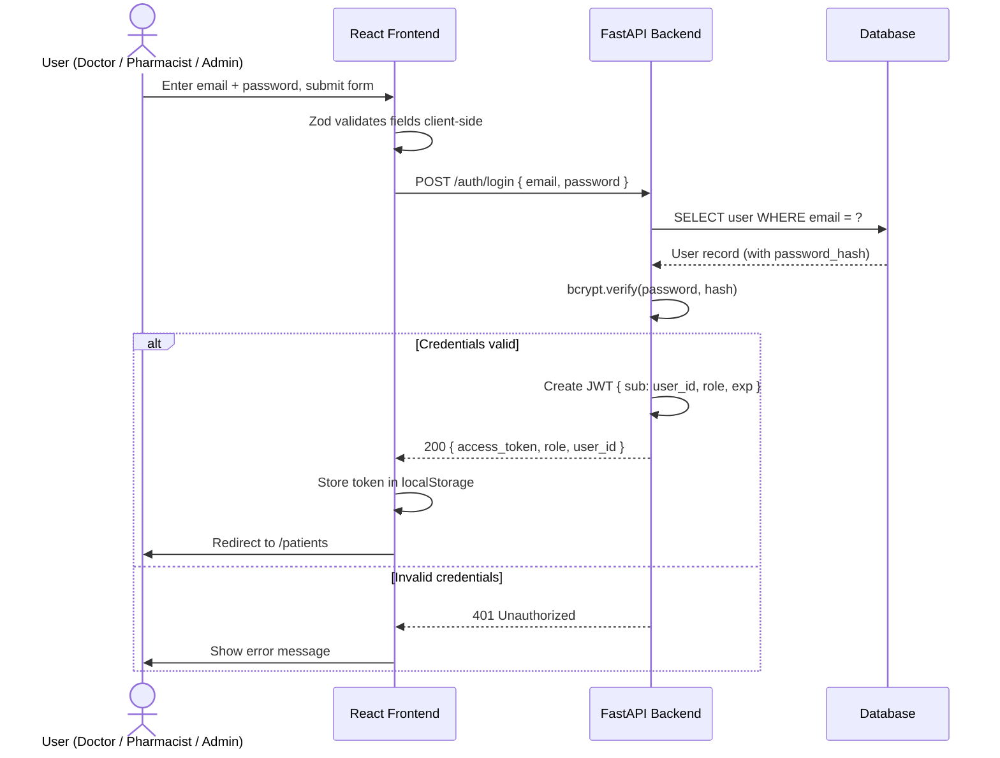
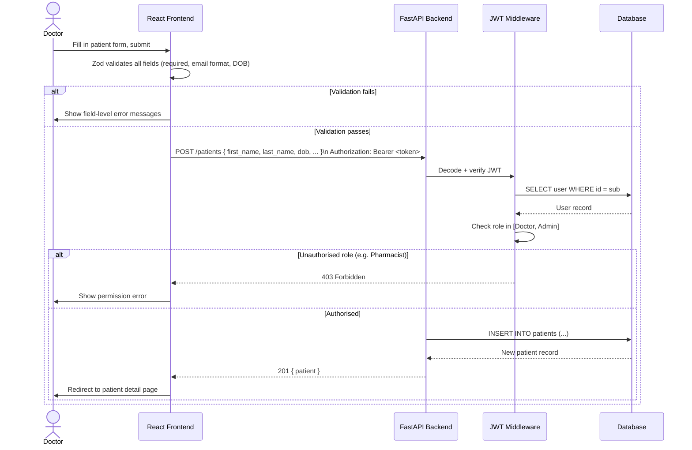
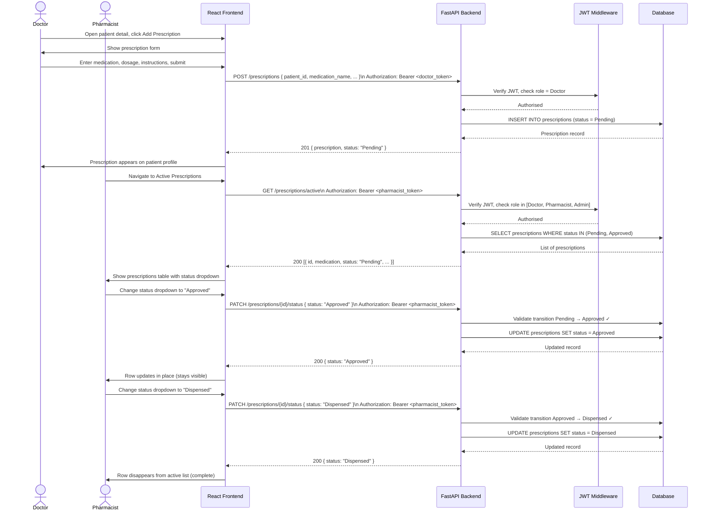
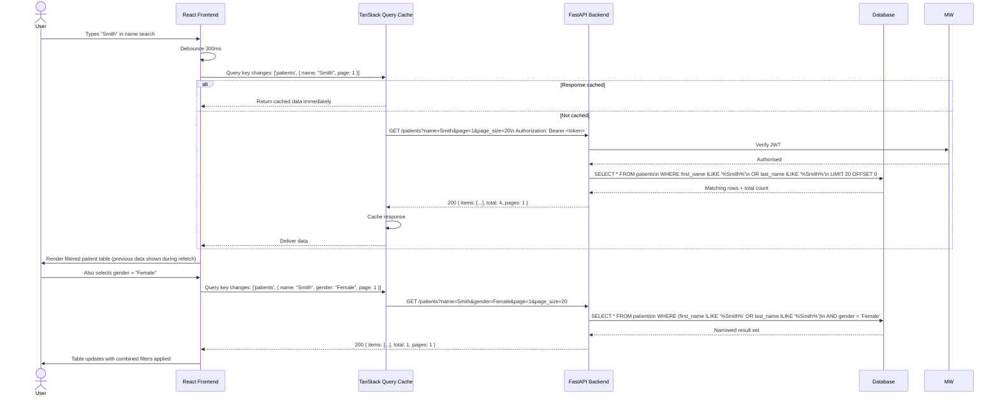

# Healthcare Platform – System Flow Diagrams

Sequence diagrams covering the three core workflows. Each can be rendered by pasting into [https://mermaid.live](https://mermaid.live).

---

## Scenario 1: User Authentication (Login)

A healthcare professional signs in and gains access to protected resources.

---

## Scenario 2: Patient Registration

A Doctor or Admin registers a new patient in the system.

---

## Scenario 3: Prescription Lifecycle (Create → Approve → Dispense)

A Doctor creates a prescription; a Pharmacist processes it through to dispensing.

---

## Scenario 4: Fetch Patients with Search and Filters

A user searches the patient list by name, gender, and age range.

